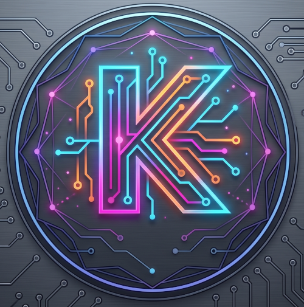
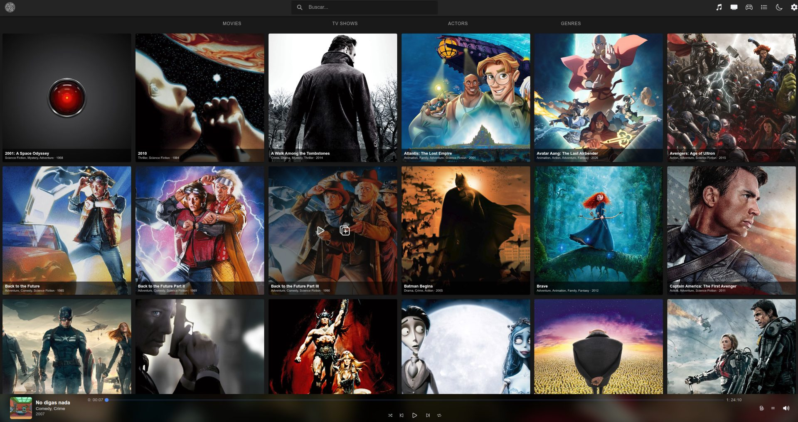
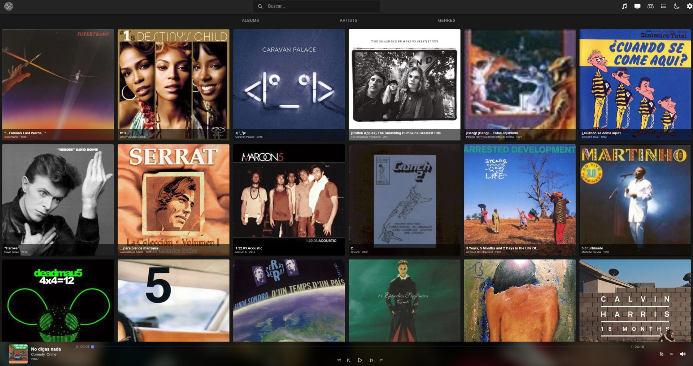
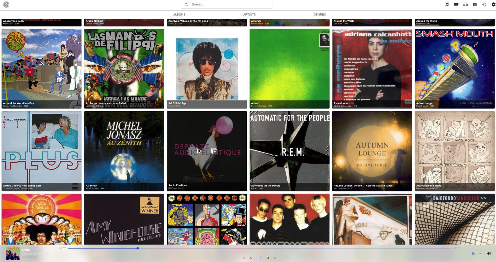
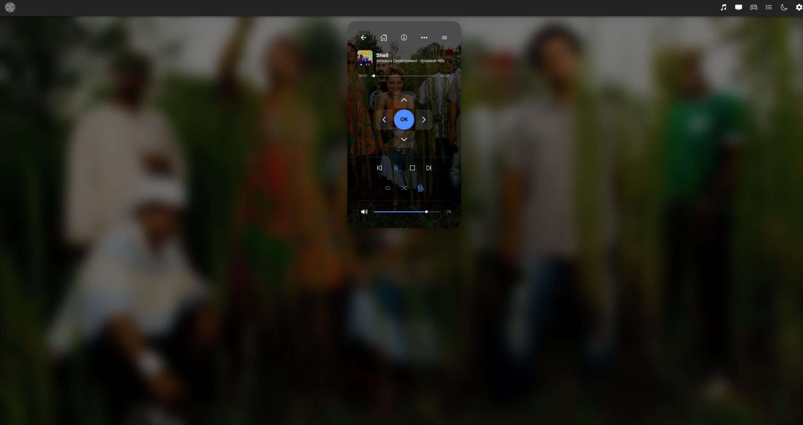
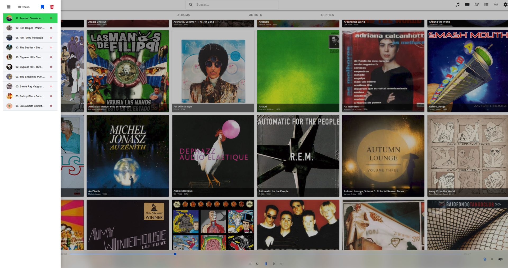

<p align="center">
  
</p>

<h1 align="center">ReaKtive</h1>

<p align="center">
  A modern, reactive web interface to control your Kodi media center.
</p>

<p align="center">
  
  
  
</p>

<p align="center">
  
</p>

**ReaKtive** is a web frontend built with **Angular** and **Ionic** that lets you
browse, fix and control your Kodi media library from any browser, in real time.
It ships as a Kodi add-on (`webinterface.reaktive`): install it once and Kodi
serves it itself, no separate server and no configuration.

---

## Screenshots

<table>
  <tr>
    <td width="50%">
      
      <p align="center"><em>Music library — dark theme</em></p>
    </td>
    <td width="50%">
      
      <p align="center"><em>The same library — light theme</em></p>
    </td>
  </tr>
  <tr>
    <td width="50%">
      
      <p align="center"><em>Remote control, over the artwork of what is playing</em></p>
    </td>
    <td width="50%">
      
      <p align="center"><em>Play queue, reorderable</em></p>
    </td>
  </tr>
</table>

## Features

### Browse and play

- **Music & Video libraries** - Albums, Artists, Genres, Movies, TV Shows and Actors, with infinite scroll over paginated JSON-RPC queries
- **Real-time playback control** - Play, pause, stop, seek, volume, shuffle, repeat and party mode, kept in sync over WebSocket
- **Remote control** - Full D-Pad navigation to drive Kodi from any browser, over the artwork of whatever is playing
- **Play queue** - View, reorder and save the current playlist
- **Global search** - One search box across the whole library

### Fix your library

Scrapers get things wrong. ReaKtive lets you correct them without leaving the browser:

- **Metadata editing** - Albums, artists, movies and TV shows, with schema-driven forms that mirror what the JSON-RPC API actually accepts
- **Artwork** - Set poster, fanart, thumb and banner by URL or by picking a file through Kodi's own file browser
- **Re-scrape a single item** - Refresh one movie or show against its scraper, optionally passing the right title, year or IMDb id when the filename misleads it
- **Export / import** - Take one item's metadata out as JSON, edit it, and bring it back in
- **File paths** - See the real path and filename behind every item, so you know which file the wrong data belongs to

### Everyday quality

- **Light & Dark themes** - Follows the OS preference, with a manual toggle
- **Responsive design** - Desktop and mobile layouts
- **Connection aware** - Live connection status, automatic WebSocket reconnection with backoff, and library scan/clean progress
- **Honest error states** - A failed request says so and offers a retry, instead of pretending the library is empty

## Tech Stack

| Layer          | Technology                          |
| -------------- | ----------------------------------- |
| Framework      | Angular 20                          |
| UI Components  | Ionic 8                             |
| Architecture   | Domain-Driven Design (DDD)          |
| Real-time      | WebSockets (Kodi's port, `9090` by default) |
| API            | JSON-RPC over HTTP (Kodi's web server port) |
| State          | Angular Signals (zoneless)          |
| Styling        | SCSS with ITCSS methodology         |
| Linting        | ESLint + Husky + lint-staged        |
| CI/CD          | GitHub Actions                      |

## Prerequisites

- [Node.js](https://nodejs.org/) >= 18
- [npm](https://www.npmjs.com/) >= 9
- A running **Kodi** instance with:
  - **Web interface** enabled (_Settings > Services > Control > Allow remote control via HTTP_)
  - **WebSocket** access (port `9090` by default; configurable from _Settings_ inside the app)
  - **HTTP JSON-RPC** access on Kodi's web server port (`8080` by default)

## Installation

```bash
# Clone the repository
git clone https://github.com/Thebluemax/kodi-reactive.git
cd kodi-reactive

# Install dependencies
npm install

# Point the dev proxy at your Kodi box and start it (leave it running)
KODI_URL=http://192.168.1.50:8080 npm run proxy

# In another terminal, start the development server
npm start
```

The app will be available at `http://localhost:4200`.

In development the browser talks to `ops/proxy.js` on port `8008`, which forwards
to Kodi and adds the CORS headers Kodi does not send. In production none of that
applies: the add-on is served by Kodi itself, so the app derives protocol, host
and port from `window.location` and calls `/jsonrpc` directly.

## Build

```bash
# Production build
npm run build
```

The output is generated in `www/` (with a relative `<base href="./">` so the app works from any path Kodi serves it on) and can be served by any static file server or packaged as a Kodi add-on.

### Install as Kodi Add-on (manual zip)

1. Run `make package`. It builds the app and assembles `build/webinterface.reaktive/` (bundle + `addon.xml` + `icon.png`), then zips it to `build/webinterface.reaktive.zip`.
2. Install the zip in Kodi via _Settings > Add-ons > Install from zip file_.
3. Activate the web interface in _Settings > Services > Control > Web interface_.

Manually installed add-ons never auto-update. Use the repository below instead if you want Kodi to pull new versions on its own.

## Kodi Repository (auto-updates)

Published add-ons live on the `gh-pages` branch of this repo, served over GitHub Pages and indexed by `addons.xml` / `addons.xml.md5`, the standard `xbmc.addon.repository` format. Installing `repo.reaktive` once lets Kodi discover and install every later `webinterface.reaktive` release by itself.

### First-time install

1. _Settings > File manager > Add source_ and enter this URL, naming the source `reaktive`:

   ```
   https://thebluemax.github.io/kodi-reactive/
   ```

2. _Settings > Add-ons > Install from zip file_ > `reaktive` > `repo.reaktive.zip`.
3. _Settings > Add-ons > Install from repository > Reaktive Repository > Look and feel > Web interfaces > ReaKtive_ > **Install**.
4. Activate it in _Settings > Services > Control > Web interface_.

From now on Kodi checks the repository on its normal schedule and offers (or applies, depending on your _Add-on updates_ setting) every new version.

### Publishing a new version

Versioning is driven by `addon.xml`, which `npm version` keeps in sync with `package.json`:

```bash
npm version patch   # or minor / major -> bumps package.json + addon.xml
```

1. Merge the release branch into `main` (and back-merge into `development`).
2. Run the **Release** workflow (_Actions > Release > Run workflow_) from `main`.

That single workflow builds and tests once, then distributes the same zip through both channels: a GitHub Release asset (`webinterface.reaktive-v<version>.zip`) and the Kodi repository on `gh-pages` (`webinterface.reaktive-<version>.zip`, the filename Kodi requires, plus a regenerated `addons.xml`).

It **refuses to publish a version that already exists** on `gh-pages` — bump the semver version instead of overwriting. It also fails if `addon.xml` and `package.json` disagree, which means someone edited `addon.xml` by hand instead of using `npm version`. To overwrite a published version on purpose, run the workflow with `force=true`.

To regenerate the index locally against a checkout of `gh-pages` in `./gh-pages`:

```bash
npm run repo:index
```

## Available Scripts

| Command                | Description                                     |
| ---------------------- | ----------------------------------------------- |
| `npm start`            | Start the development server                    |
| `npm run proxy`        | CORS proxy to Kodi for development (`KODI_URL`) |
| `npm run build`        | Production build                                |
| `npm run lint`         | Run ESLint                                      |
| `npm test`             | Run unit tests                                  |
| `npm run create-issue` | Create a GitHub issue via webhook                |
| `npm run repo:index`   | Rebuild `addons.xml` / `addons.xml.md5` in `./gh-pages` |

## Project Structure

```
src/app/
├── domains/           # One folder per bounded context
│   ├── music/         # Albums, Artists, Genres, Tracks, Player, Playlist, Playback
│   ├── video/         # Movies, TV Shows, Actors
│   ├── library/       # Scan and clean events
│   ├── files/         # Kodi file browser (sources, directories, downloads)
│   ├── remote/        # Remote control
│   └── settings/      # Connection settings
├── layout/            # App shell and main layout
└── shared/            # Cross-domain code (RPC and socket services, components, pipes, utils)
```

Every domain follows the same four layers:

```
<domain>/
├── domain/            # Entities and repository interfaces — no Angular, no HTTP
├── application/       # Use cases and facades
├── infrastructure/    # Repository implementations that speak JSON-RPC
└── presentation/      # Standalone components, OnPush, signal-driven
```

Nothing talks to Kodi directly: `KodiRpcService` is the single JSON-RPC client
and `KodiSocketService` the single WebSocket, both in `shared/services`.

## Roadmap

- [x] DDD architecture across every domain (entities, use cases, repositories)
- [x] Externalized configuration (connection derived at runtime, WS port editable in Settings)
- [x] Kodi Add-on packaging with automated releases and a self-hosted repository
- [x] Video support (Movies, TV Shows, Actors)
- [x] Library editing: metadata, artwork, re-scraping, export/import
- [ ] Internationalization (Spanish and English)
- [ ] Migrate to Angular 22
- [ ] Song-level editing UI
- [ ] Favourites
- [ ] Mobile-first improvements and PWA support

## FAQ

**Q: Does ReaKtive work on mobile devices?**
A: Yes. The interface is fully responsive and adapts to both desktop and mobile screens.

**Q: Which Kodi versions are supported?**
A: ReaKtive declares `xbmc.json` 6.0.0 and is developed against Kodi 20 (Nexus) and
later. The editing features lean on JSON-RPC v12 methods (`Media.Artwork.Set`,
`VideoLibrary.Refresh*`), so on older releases browsing and playback work while
some editing actions may be rejected by Kodi.

**Q: Can I use it outside my local network?**
A: Yes, as long as you can reach your Kodi instance's web server port and its
WebSocket port (`9090` by default). A reverse proxy with authentication is
strongly recommended: Kodi's JSON-RPC API can control and modify your whole
library, so do not expose it to the internet unprotected.

**Q: How do I change the Kodi connection settings?**
A: Installed as an add-on, ReaKtive needs no configuration: it takes protocol,
host and HTTP port from the URL Kodi serves it on. Only the WebSocket port is
adjustable, in the app's _Settings_ page, and it is remembered in the browser.
For local development, point the proxy at your box with
`KODI_URL=http://<host>:<port> npm run proxy`.

## Contributing

1. Fork the repository
2. Create your feature branch (`git checkout -b feature/my-feature`)
3. Commit your changes following [Conventional Commits](https://www.conventionalcommits.org/)
4. Push to the branch (`git push origin feature/my-feature`)
5. Open a Pull Request

## License

This project is distributed as a Kodi Add-on. See [addon.xml](addon.xml) for
add-on metadata and [CHANGELOG.md](CHANGELOG.md) for release history.

## Contact

- **Author**: [Thebluemax](https://maximilianofernandez.net/)
- **Repository**: [github.com/Thebluemax/kodi-reactive](https://github.com/Thebluemax/kodi-reactive)
- **Issues**: [GitHub Issues](https://github.com/Thebluemax/kodi-reactive/issues)
